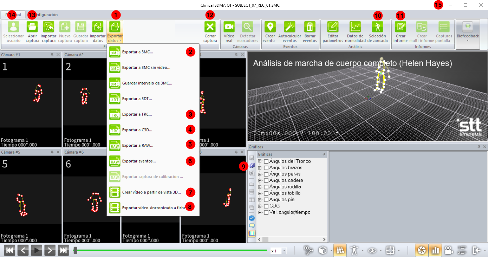
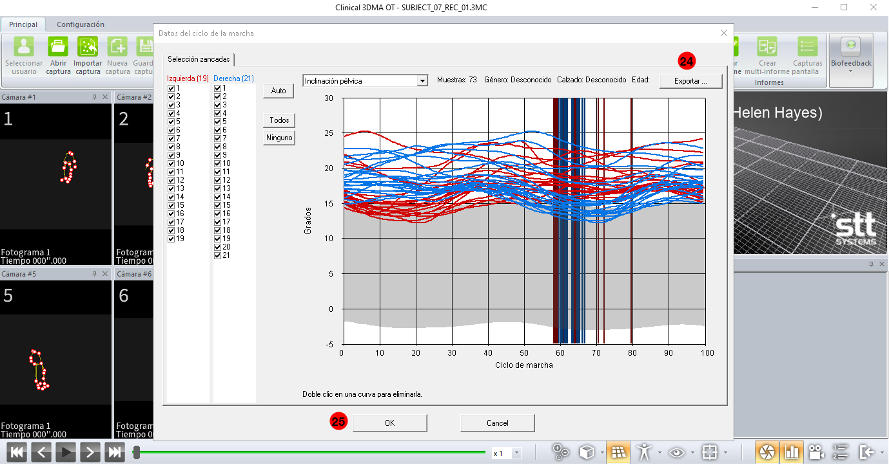

# Clinical 3DMA Exporter

*Script* basado en automatización de GUI para exportar las capturas de movimiento desde el *software* [Clinical 3DMA](https://www.stt-systems.com/motion-analysis/3d-optical-motion-capture/clinical-3dma) de *STT Systems*  en los diferentes formatos que soporta el sistema. 

## Requisitios 📋

* Clinical 3DMA **versión OT 2020.1**
* Pantalla con resolución de **1920x1080** píxeles
* Python 3

## Configuración ⚙️
El archivo de configuración en formato JSON  (`config.json`)  permite especificar el conjunto de grabaciones y formatos a exportar, así como el directorio en el que almacenar los ficheros generados. Los formatos soportados son:

* ```3mc```. Archivo que almacena todo tipo de información relacionada con la grabación.
* ```biomechanics```. Archivos CSV con datos biomecánicos.
* ```doc```. Informe Microsoft Word de análisis de marcha.
* ```video```. Vídeo sincronizado con la captura de movimiento.
* ```video3D```. Archivo de vídeo con la visualización del movimiento en 3D.
* ```strides```. CSV files with data of the strides
* ```3dt```. Archivo de captura en formato 3DT
* ```trc```. Trayectoria de marcadores en formato TRC.
* ```raw```. Trayectoria de marcadores en formato TXT.
* ```events```. Fichero TXT con tiempos de eventos.
* ```c3d```.  Archivo de captura en formato C3D

### Sistema de coordenadas

La posición en la pantalla, basada en el sistema de coordenadas de Windows 10, de los principales componentes de la GUI de Clinical 3DMA se han definido en el archivo `gui_coordinates.py`. Las siguientes imágenes representan gráficamente el elemento de la interfaz al que se refiere cada uno de los componentes definidos en este archivo.






<table>

<tr><td>

| Elemento 	|        Nombre       	|
|:--------:	|:-------------------:	|
|     1    	| EXPORT_DATA         	|
|     2    	| EXPORT_3MC          	|
|     3    	| EXPORT_TRC          	|
|     4    	| EXPORT_C3D          	|
|     5    	| EXPORT_RAW          	|
|     6    	| EXPORT_EVENTS       	|
|     7    	| EXPORT_VIDEO_3D     	|
|     8    	|  EXPORT_VIDEO_FEED  	|
|     9    	| EXPORT_BIOMECHANICS 	|
| 10       	| STRIDE_SELECTION    	|
| 11       	| CREATE_REPORT       	|
| 12       	| CLOSE_CAPTURE       	|
| 13       	| OPEN_CAPTURE        	|
| 14       	| SELECT_USER         	|
| 15       	| MINIMIZE_3DMA       	|

</td><td>

| Elemento 	|          Nombre          	|
|:--------:	|:------------------------:	|
|    16    	| BD_SEARCH_USER       	    |
|    17    	| BD_SEARCH_CAPTURE         |
|    18    	| BD_SELECT_USER           	|
|    19    	| BD_SELECT_CAPTURE        	|
|    20    	| BD_CONFIRM               	|
|    21    	| EXPORT_TRC_EXPLORER      	|
|    22    	| EXPORT_TRC_OK            	|
|    23    	|       EXPORT_C3D_OK      	|
|    24    	|      EXPORT_STRIDES      	|
| 25       	| EXPORT_STRIDES_OK        	|
| 26       	| CREATE_REPORT_WALKING    	|
| 27       	| CREATE_REPORT_SELECT     	|
| 28       	| CREATE_REPORT_OK         	|
| 29       	| MICROSOFT_OFFICE_CLOSE   	|
| 30       	| MICROSOFT_OFFICE_LICENSE 	|

</td></tr> </table>

## Uso 🚀


```
pip install -r requirements.txt
```

```
python 3dma_exporter.py
```